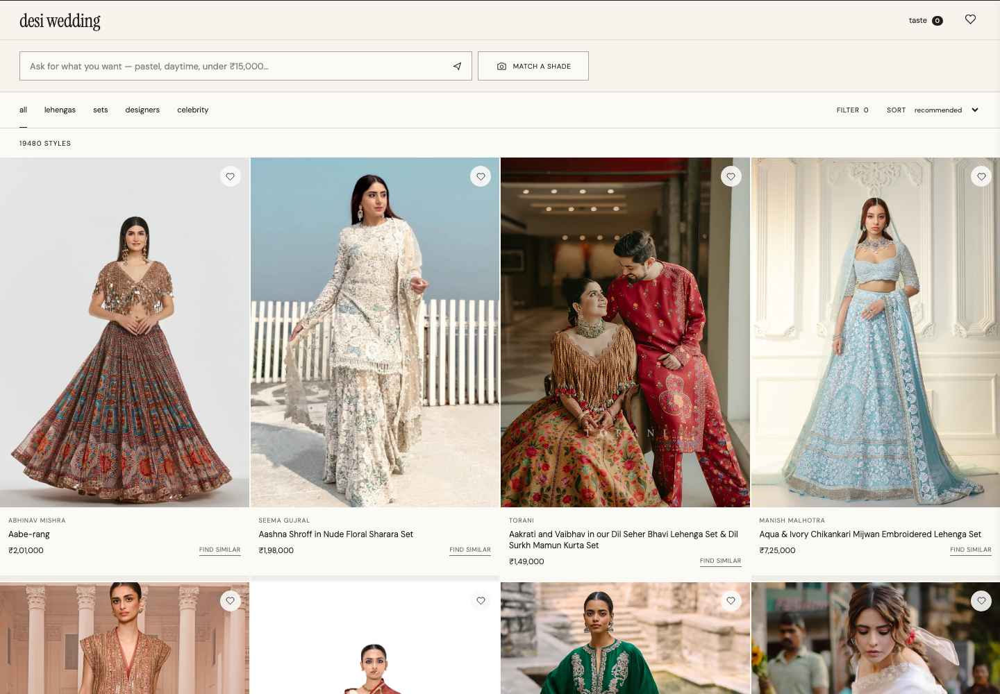

# Desi Wedding

A responsive, dependency-free interaction prototype for conversational Indian wedding guestwear discovery.



## Run locally

Open `index.html` directly, or run a static server:

```bash
cd /Users/nandinitalwar/indian-wedding
python3 -m http.server 4180
```

Then visit `http://localhost:4180`.

## Develop with Kimi K3 through OpenRouter

This repository includes an `opencode.json` that selects `openrouter/moonshotai/kimi-k3` by default.

1. Create an API key at [OpenRouter](https://openrouter.ai/settings/keys) and set a spending limit.
2. From this folder, run `opencode`.
3. Enter `/connect`, choose **OpenRouter**, and paste the key when prompted. OpenCode stores the credential outside this repository.
4. Start describing the change you want. Use `/models` if you need to reselect **Kimi K3**.

Never paste or commit the API key into this repository.

## What works

- Natural-language queries interpret occasion, colour, garment type, and budget.
- The collection visibly rerenders after each query or product-level refinement.
- Budget, silhouette, colour, and sorting controls remain familiar and editable.
- Taste memory and saved items persist in local storage.
- Product details explain why a result matches and link out to its retailer.
- The catalog is deliberately isolated in `app.js`, ready to be replaced by retailer feeds.
- `catalog-sources.json` provides the initial retailer partnership/ingestion shortlist.
- `instagram-accounts.json` is a 138-account celebrity, stylist, editor and fashion-creator discovery repository. It is deliberately independent of a third-party editorial publication.
- `scripts/sync-instagram.mjs` uses Meta's official Instagram Business Discovery API to collect public professional/creator posts into `instagram-looks.json`.
- Celebrity cards link to the original Instagram profile or post. Designer-attributed posts link to that designer's official collection; Sabyasachi attribution routes to Sabyasachi Weddings.
- `shopping-sources.json` powers a separate searchable designers page with official women’s shopping destinations across couture labels, independent designers and trusted multi-brand retailers.
- `featured-instagram-looks.json` contains specific wedding-post permalinks used by the visual inspiration page; it never substitutes a generic profile feed.
- `docs/catalog-system.md` and `schemas/` define the permissioned 10k+ SKU ingestion, enrichment and retrieval system that should replace the nine-item front-end fixture.

## Sync public Instagram looks legally

The official API requires your own Professional Instagram account connected to a Facebook Page. Create a Meta app, grant the documented Instagram read permissions, and use a Page/Instagram token. App Review and Advanced Access may be required before serving accounts you do not own.

Run the sync without putting a token in the repository:

```bash
cd /Users/nandinitalwar/indian-wedding
META_ACCESS_TOKEN='…' \
META_IG_USER_ID='…' \
META_GRAPH_VERSION='vXX.X' \
node scripts/sync-instagram.mjs
```

Only public Business and Creator accounts are eligible. The official API does not provide Orry's following graph, so Orry is retained as an editorial discovery seed rather than accessed through private endpoints. Add accounts found through manual editorial review to `instagram-accounts.json`, then resync. Media URLs can expire; the canonical record is always the original Instagram permalink.

## Data boundary

The current catalog slice uses specific KALKI product pages, matching product imagery, and prices collected on July 15, 2026. Every product image and name links to the exact retailer item. Prices and availability can change, so a launch build still needs an approved affiliate feed or retailer-permitted ingestion with freshness checks.

`scripts/sync-kalki-catalog.mjs` refreshes the localhost prototype from KALKI’s public Shopify collection endpoint, which is discoverable through its published sitemap and not disallowed by its robots policy. It rate-limits requests, retains women’s garment categories, and writes exact product URLs to `catalog-live.json`. This is a prototype source adapter, not a substitute for a commercial feed agreement.

`scripts/sync-multibrand-catalog.mjs` adds direct designer inventory from the crawl-permitted Shopify storefronts in `catalog-shopify-sources.json`, writes `catalog-multibrand.json`, and powers brand-balanced ranking plus the visible brand facet.

The repository contains no copied celebrity imagery. Synced records use the original Instagram permalink and API-returned media URL. For a public launch, render Instagram's official embed or use separately licensed imagery, retain attribution, and refresh expiring media URLs.

The current natural-language layer is a deterministic front-end prototype so the interaction can be tested without exposing an API key. A production build should send the query, current filters, taste memory, and optional anchor product to a server-side LLM endpoint that returns validated structured filters and ranking signals.
